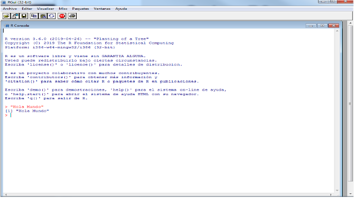
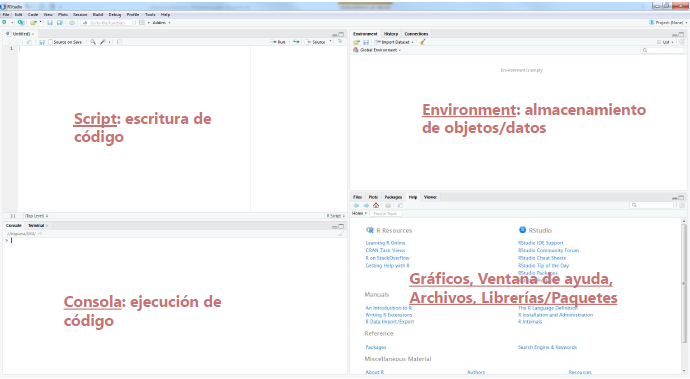
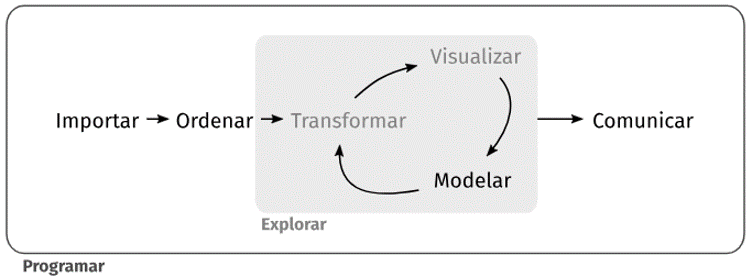
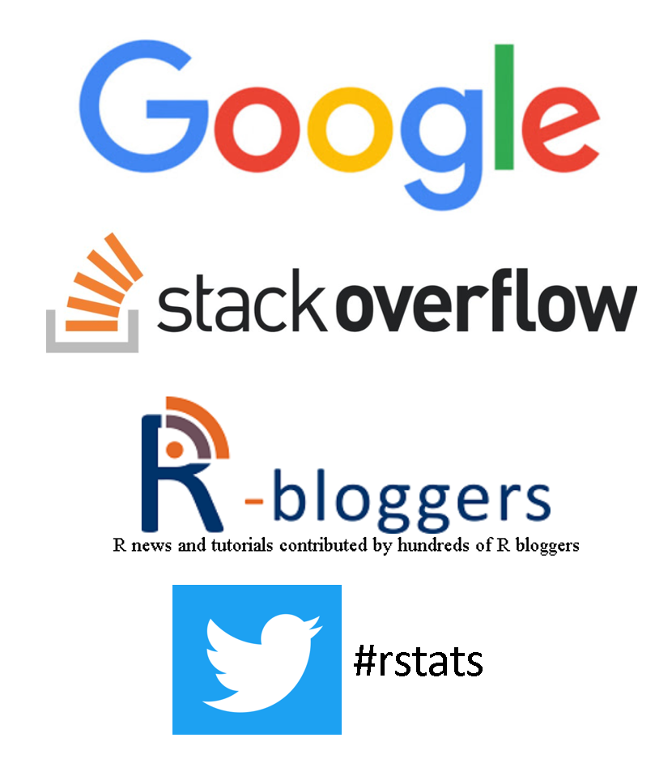
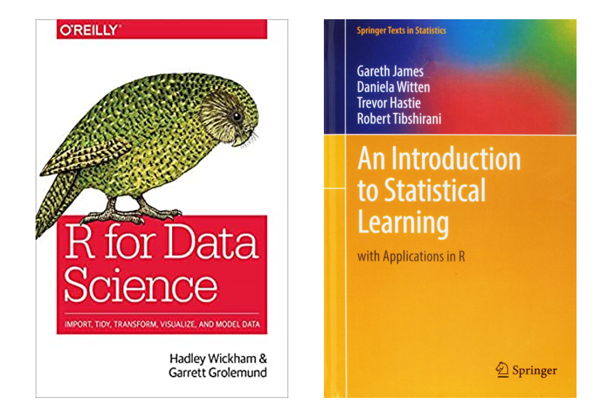
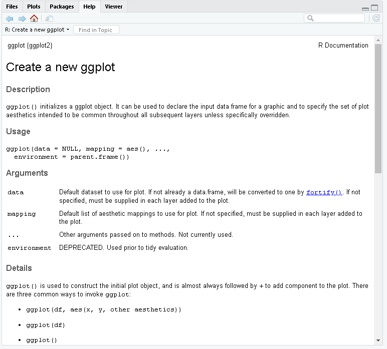
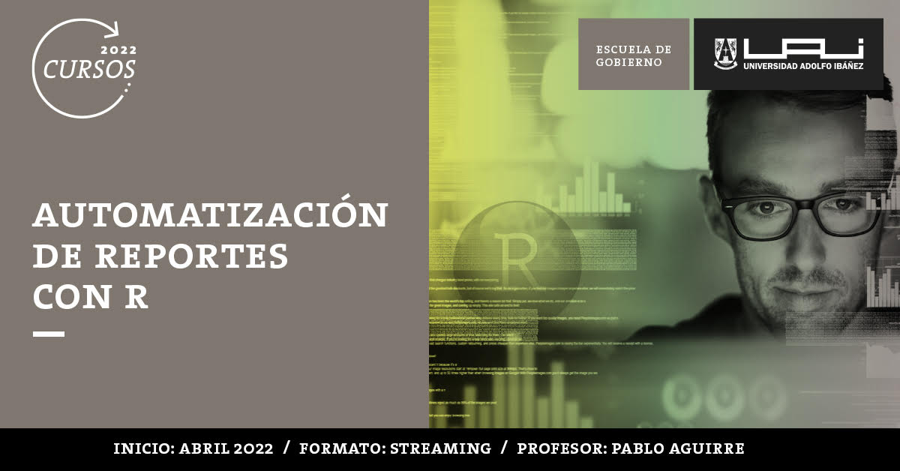
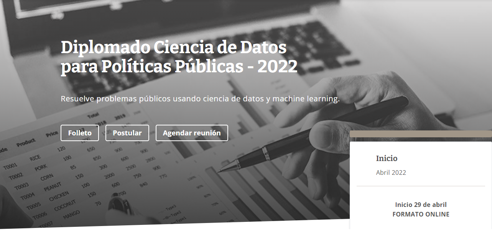

```{r setup, include = FALSE, purl = FALSE}
options(htmltools.dir.version = FALSE)
library(knitr)
opts_chunk$set(
  fig.align="center",  
  fig.height=4, #fig.width=6,
  dpi=300, #fig.path='Figs/',
  cache=T,#, echo=F, warning=F, message=F,
  echo = FALSE,
  message = FALSE,
  warning = FALSE,
  error = FALSE,
  out.width = "90%"
  )
library(tidyverse)
library(hrbrthemes)
library(fontawesome)
library(patchwork)
xaringanExtra::use_scribble(pen_size = 1)
htmltools::tagList(
  xaringanExtra::use_clipboard(
    button_text = "<i class=\"fa fa-clipboard\"></i>",
    success_text = "<i class=\"fa fa-check\" style=\"color: #90BE6D\"></i>",
  ),
  rmarkdown::html_dependency_font_awesome()
)
```

# Me presento

- **Docente GobLab UAI**
  * [Diplomado Ciencia de Datos para Políticas Públicas](https://gobierno.uai.cl/diplomado/diplomado-big-data-politicas-publicas/)
  * [Automatización de reportes con R Markdown](https://gobierno.uai.cl/curso/automatizacion-de-reportes-con-r/)
  * [Introducción a R (curso online)](https://uaionline.uai.cl/curso/r-para-ciencias-sociales)
  
- **Superintendencia del Medio Ambiente**
  * División de Seguimiento e Información Ambiental
  * Inteligencia Ambiental

- **Formación**:
  * Ingeniero Agrónomo (UC)
  * Master of Public Policy (UChicago)
  * Estudiante PhD Ingeniería (UC)

---

# ¿Qué veremos?

- **Introducción**
  * ¿Qué es R/RStudio?
  * ¿Por qué usar estas herramientas?

- **Demostraciones**: elecciones diciembre 2021
  * Análisis de datos
  * Reporte automático
  * Dashboard/Aplicación

<br> 

```{r, out.width = "40%"}
knitr::include_graphics("Imagenes/RServel.png")
```

---
class: inverse, center, middle
name: reg

# ¿Qué es R/RStudio?

<html><div style='float:left'></div><hr color='#EB811B' size=1px width=796px></html>

---

# ¿Qué es R?

- **Lenguaje y plataforma**
  * Lenguaje y ambiente de programación estadística
  * Herramienta de visualización de datos
  * <span style="color:red">**Gratuito**</span>
  
- **Ecosistema**
  * Muchas aplicaciones e integraciones con otras plataformas
  * +15.000 librerías gratuitas disponibles
  
- **Comunidad**
  * Millones de usuarios
  * Muchos y diversos grupos de usuarios a nivel mundial

<br>

.center[
https://www.r-project.org
]

---

# ¿Qué es R?

<br>

```{r, echo = FALSE, out.width = "100%"}

```

---

# ¿Qué es RStudio?

- **IDE para R**: *Entorno de desarrollo integrado*

- **Editor de código**
  * Auto-completación
  * Ayuda de sintaxis
  * Debugging
  
- **Herramientas para distintas tareas**
  * Visualización
  * Conexión con otras plataformas
  * Depuración de código
  * Manejo del ambiente de trabajo

<br>

.center[
https://www.rstudio.com
]

---

# ¿Qué es RStudio?

<br>

```{r, echo = FALSE, out.width = "100%"}

```

---
class: inverse, center, middle
name: reg

# ¿Por qué usar estas herramientas?

<html><div style='float:left'></div><hr color='#EB811B' size=1px width=796px></html>

---

# ¿Por qué usar estas herramientas?

- Control/Flexibilidad

- Reproducibilidad


```{r, out.width = "80%"}

```

---

# Control del proceso

<br>
<br>
<br>

```{r, out.width='90%',  echo = FALSE, out.width='750px'}

```

---

# Reproducibilidad

**Objetivo: realizar un reporte basado en datos de [Datos Públicos](http://datos.gob.cl/)**

.pull-left[

**<span style="color:red">SIN PROGRAMACIÓN</span>**

1. Ingresar a la web y descargar datos
2. Limpiar, ordenar, y analizar datos en *MS Excel*
3. Escribir documento en *MS Word*
4. Guardar en "algún lado" (ojalá no en "Mis Documentos" o "Descargas")

]

---

# Reproducibilidad

**Objetivo: realizar un reporte basado en datos de [Datos Públicos](http://datos.gob.cl/)**

.pull-left[

**<span style="color:red">SIN PROGRAMACIÓN</span>**

1. Ingresar a la web y descargar datos
2. Limpiar, ordenar, y analizar datos en *MS Excel*
3. Escribir documento en *MS Word*
4. Guardar en "algún lado" (ojalá no en "Mis Documentos" o "Descargas")

]

.pull-right[

**<span style="color:green">CON PROGRAMACIÓN</span>**

1. Crear una carpeta para el proyecto/tarea
    * `datos`
    * `gráficos`
    * `resultados`
2. Descargar datos desde `R`
3. Limpiar, ordenar, y analizar datos en `R`
4. Escribir documento en `R Markdown`

]

---

# Reproducibilidad

**Seis meses después quieres repetir la tarea (o un/a colega)**

.pull-left[

**<span style="color:red">SIN PROGRAMACIÓN</span>**

1. Recordar que se hizo
2. Ingresar a la web y descargar datos
3. Limpiar, ordenar, y analizar datos en *MS Excel*
4. Escribir documento en *MS Word*
5. Guardar en "algún lado" (ojalá no en "Mis Documentos" o "Descargas")

]

---

# Reproducibilidad

**Seis meses después quieres repetir la tarea (o un/a colega)**

.pull-left[

**<span style="color:red">SIN PROGRAMACIÓN</span>**

1. Recordar que se hizo
2. Ingresar a la web y descargar datos
3. Limpiar, ordenar, y analizar datos en *MS Excel*
4. Escribir documento en *MS Word*
5. Guardar en "algún lado" (ojalá no en "Mis Documentos" o "Descargas")

]

.pull-right[

**<span style="color:green">CON PROGRAMACIÓN</span>**

1. Ejecutar el código

]

---
class: inverse, center, middle
name: reg

# Demostraciones

<html><div style='float:left'></div><hr color='#EB811B' size=1px width=796px></html>

---

# Tres ejemplos

Usando datos obtenidos directamente desde [SERVEL](https://www.servelelecciones.cl/) sobre las elecciones de segunda vuelta presidencial, realizaremos tres demostraciones:

1. Análisis de datos (R/RStudio)

2. Reporte automático (Markdown)

3. Dashboard (Shiny) 

---

# GitHub

.center[https://github.com/pjaguirreh/Charla-UAI-Enero-2022]

```{r, out.width = "100%"}
knitr::include_graphics("Imagenes/GitHub.png")
```

---
class: inverse, center, middle
name: reg

# Siguientes pasos

<html><div style='float:left'></div><hr color='#EB811B' size=1px width=796px></html>

---

# A tener en cuenta

### Paquetes

Por defecto, `R` tiene un número finito de funcionalidades que se puede extender utilizando un gran número de **paquetes**.

_Instalar paquetes (una vez<sup>1</sup>)_:

`install.packages("NombrePaquete")`

*Cargar paquetes (cada vez que se abra R/RStudio)*:

`library("NombrePaquete")`

.pull-left[.footnote[<sup>1</sup> *En realidad, cada cierto tiempo uno querrá instalar (o actualizar) ciertos paquetes para acceder a nuevas versiones*.]]

---

# Fuentes valiosas de información 

```{r, echo = FALSE, out.width='450px'}

```

---

# Fuentes valiosas de información 

```{r, echo = FALSE, out.width='600px'}

```

- https://r4ds.had.co.nz/ | https://es.r4ds.hadley.nz/
- http://faculty.marshall.usc.edu/gareth-james/ISL/

---

# Además de google...

No se aburran de usar `?nombrefunción`. Ej: `?ggplot`

```{r, echo=FALSE, out.width='500px'}

```

---
class: inverse, center, middle
name: reg

# Oferta académica GobLab UAI

<html><div style='float:left'></div><hr color='#EB811B' size=1px width=796px></html>

---

# Introducción a R

<br>

```{r, out.width = "100%"}

```

---

# Automatización de Reportes

<br>

```{r, out.width = "100%"}

```

---

# Diplomado Cs. Datos PP

<br>

```{r, out.width = "100%"}

```

---

# Gracias

- Twitter: [@PAguirreH](https://twitter.com/PAguirreH)

- LinkedIn: https://www.linkedin.com/in/pjaguirreh/

- GitHub: https://github.com/pjaguirreh

- Correo: pjaguirreh@gmail.com